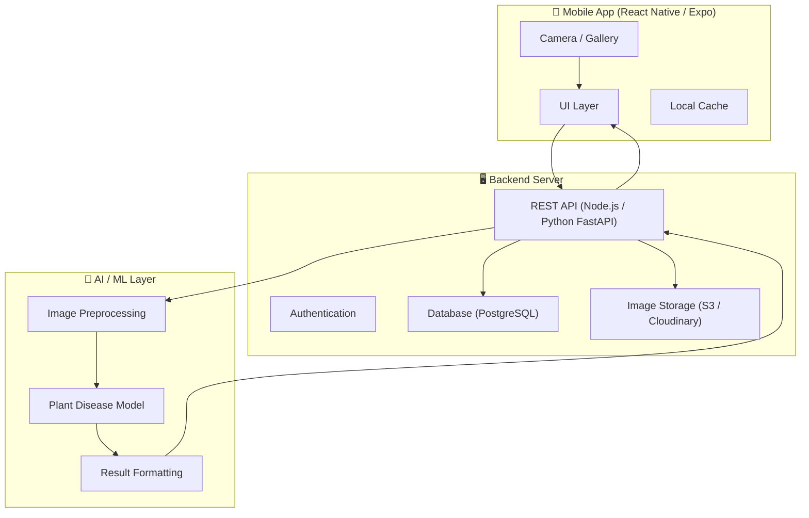
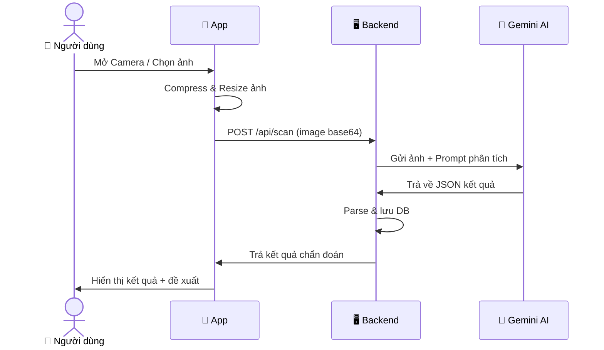

# 🌿 AI Plant Health Scanner — Hướng Dẫn Kiến Trúc & Lộ Trình

## Tổng Quan

Xây dựng một ứng dụng di động cho phép người dùng **chụp ảnh hoặc chọn ảnh cây trồng**, gửi lên AI để **phân tích tình trạng sức khỏe** (bệnh lá, thiếu dinh dưỡng, sâu bệnh...) và nhận lại **kết quả chẩn đoán + đề xuất xử lý**.

### Tech Stack hiện tại
| Layer | Công nghệ |
|-------|-----------|
| Frontend | React Native (Expo SDK 54), expo-router, NativeWind/TailwindCSS |
| Backend | Chưa có (thư mục `Backend/` trống) |
| AI/ML | Cần chọn (xem bên dưới) |

---

## 1. Kiến Trúc Tổng Thể (System Architecture)



---

## 2. Lựa Chọn AI Model — 3 Hướng Đi

> [!IMPORTANT]
> Đây là quyết định quan trọng nhất. Mỗi hướng có trade-off riêng về chi phí, độ chính xác, và độ phức tạp.

### Hướng A: Dùng API AI có sẵn (⭐ Khuyến nghị cho MVP)

| Dịch vụ | Ưu điểm | Nhược điểm | Chi phí |
|---------|---------|------------|---------|
| **Google Gemini Vision** | Rất mạnh nhận diện thực vật, hỗ trợ tiếng Việt tốt | Phụ thuộc API | Free tier rộng rãi |
| **OpenAI GPT-4 Vision** | Chẩn đoán chi tiết, dễ tích hợp | Đắt hơn | ~$0.01/ảnh |
| **Plant.id API** | Chuyên biệt cho thực vật, có sẵn dataset bệnh | Ít linh hoạt | Free 100 req/ngày |
| **Plantix API** | Database bệnh cây lớn nhất | Giới hạn vùng | Liên hệ |

**Cách tích hợp:**
```
Mobile → Backend API → Gemini/GPT-4 Vision API → Kết quả → Mobile
```

### Hướng B: Tự Train Model (Cho sản phẩm chuyên sâu)

- **Dataset**: [PlantVillage](https://github.com/spMohanty/PlantVillage-Dataset) (~87K ảnh, 38 loại bệnh)
- **Model**: TensorFlow/PyTorch → Fine-tune MobileNetV3 hoặc EfficientNet
- **Deploy**: TensorFlow Serving hoặc ONNX Runtime trên server
- **Ưu điểm**: Kiểm soát hoàn toàn, không phụ thuộc bên thứ 3
- **Nhược điểm**: Cần thời gian train, cần GPU, cần data quality

### Hướng C: On-Device AI (Xử lý trên điện thoại)

- **Công cụ**: TensorFlow Lite + `expo-tflite` hoặc `react-native-fast-tflite`
- **Ưu điểm**: Không cần internet, phản hồi nhanh, bảo mật dữ liệu
- **Nhược điểm**: Model bị giới hạn kích thước, độ chính xác thấp hơn

> [!TIP]
> **Khuyến nghị**: Bắt đầu với **Hướng A (Google Gemini Vision)** vì:
> - Free tier đủ dùng cho development & MVP
> - Hỗ trợ tiếng Việt tốt
> - Không cần train model
> - Có thể chuyển sang Hướng B/C sau khi validate ý tưởng

---

## 3. Cấu Trúc Project Đề Xuất

```
MobileFoodApp/
├── Frontend/
│   ├── app/                          # Expo Router pages
│   │   ├── _layout.tsx               # Root layout
│   │   ├── index.tsx                 # Splash/Welcome screen
│   │   └── (tabs)/                   # Tab navigation
│   │       ├── _layout.tsx           # Tab layout
│   │       ├── home.tsx              # Home screen
│   │       ├── scan.tsx              # 📸 Camera/Scan screen
│   │       ├── history.tsx           # Lịch sử quét
│   │       └── profile.tsx           # Hồ sơ người dùng
│   │
│   ├── src/
│   │   ├── components/
│   │   │   ├── ui/                   # Reusable UI (Button, Card, Modal...)
│   │   │   ├── scan/                 # Scan-related components
│   │   │   │   ├── CameraView.tsx    # Camera preview
│   │   │   │   ├── ImagePicker.tsx   # Gallery picker
│   │   │   │   ├── ScanResult.tsx    # Hiển thị kết quả
│   │   │   │   └── ScanLoading.tsx   # Loading animation
│   │   │   └── plant/
│   │   │       ├── PlantCard.tsx     # Card thông tin cây
│   │   │       ├── DiseaseInfo.tsx   # Chi tiết bệnh
│   │   │       └── TreatmentGuide.tsx # Hướng dẫn xử lý
│   │   │
│   │   ├── services/
│   │   │   ├── aiService.ts          # Gọi AI API (Gemini/GPT)
│   │   │   ├── imageService.ts       # Xử lý ảnh (resize, compress)
│   │   │   └── storageService.ts     # Local storage
│   │   │
│   │   ├── hooks/
│   │   │   ├── useCamera.ts          # Camera logic
│   │   │   ├── useScan.ts            # Scan workflow
│   │   │   └── useScanHistory.ts     # History management
│   │   │
│   │   ├── types/
│   │   │   ├── plant.ts              # Plant & Disease types
│   │   │   └── scan.ts               # Scan result types
│   │   │
│   │   ├── constants/
│   │   │   ├── prompts.ts            # AI prompt templates
│   │   │   └── diseases.ts           # Danh sách bệnh phổ biến
│   │   │
│   │   └── utils/
│   │       ├── imageUtils.ts         # Compress, resize ảnh
│   │       └── formatResult.ts       # Format AI response
│   │
│   └── assets/
│       ├── icons/                    # Custom icons
│       └── images/                   # Static images
│
├── Backend/                          # (Phase 2)
│   ├── src/
│   │   ├── routes/
│   │   │   ├── scan.ts               # POST /api/scan
│   │   │   └── history.ts            # GET /api/history
│   │   ├── services/
│   │   │   ├── geminiService.ts      # Google Gemini integration
│   │   │   └── imageService.ts       # Image processing
│   │   ├── models/
│   │   │   └── scan.ts               # Scan result model
│   │   └── index.ts                  # Server entry
│   ├── package.json
│   └── .env
│
└── README.md
```

---

## 4. Luồng Hoạt Động Chính (Core User Flow)



---

## 5. Packages Cần Cài Đặt

### Frontend (Expo)
```bash
# Camera & Image
npx expo install expo-camera expo-image-picker expo-image-manipulator

# Storage
npx expo install @react-native-async-storage/async-storage

# Animations (đã có reanimated)
# expo-haptics đã có

# Icons (đã có @expo/vector-icons)
```

### Backend (Node.js hoặc Python)

**Option A: Node.js (Express/Fastify)**
```bash
npm init -y
npm install express @google/generative-ai multer cors dotenv
npm install -D typescript @types/express ts-node nodemon
```

**Option B: Python (FastAPI) — Khuyến nghị nếu muốn custom ML sau này**
```bash
pip install fastapi uvicorn google-generativeai python-multipart pillow
```

---

## 6. Ví Dụ Prompt AI (Gemini Vision)

```typescript
// src/constants/prompts.ts

export const PLANT_SCAN_PROMPT = `
Bạn là chuyên gia nông nghiệp và bệnh cây trồng. 
Hãy phân tích ảnh cây trồng này và trả về kết quả dưới dạng JSON:

{
  "plant_name": "Tên cây (tiếng Việt)",
  "plant_name_scientific": "Tên khoa học",
  "health_status": "healthy | mild | moderate | severe",
  "confidence": 0.95,
  "diseases": [
    {
      "name": "Tên bệnh",
      "description": "Mô tả ngắn",
      "symptoms": ["Triệu chứng 1", "Triệu chứng 2"],
      "cause": "Nguyên nhân gây bệnh",
      "treatments": [
        {
          "type": "organic | chemical | cultural",
          "method": "Cách xử lý chi tiết",
          "products": ["Sản phẩm đề xuất"]
        }
      ],
      "prevention": ["Biện pháp phòng ngừa"]
    }
  ],
  "general_care": {
    "watering": "Gợi ý tưới nước",
    "sunlight": "Yêu cầu ánh sáng",
    "soil": "Loại đất phù hợp",
    "fertilizer": "Phân bón khuyến nghị"
  }
}

CHỈ trả về JSON, không thêm text giải thích.
`;
```

---

## 7. Lộ Trình Phát Triển (Phases)

### 🟢 Phase 1: MVP (2-3 tuần)
- [ ] Setup Camera + Image Picker
- [ ] Tích hợp Google Gemini Vision API (gọi trực tiếp từ app hoặc qua simple backend)
- [ ] UI hiển thị kết quả scan
- [ ] Lưu lịch sử scan (AsyncStorage)
- [ ] UI cơ bản cho Home, Scan, History tabs

### 🟡 Phase 2: Backend & Polish (2-3 tuần)
- [ ] Setup Backend (Node.js/FastAPI)
- [ ] API endpoints: scan, history
- [ ] Image storage (Cloudinary/S3)
- [ ] Loading animations & micro-interactions
- [ ] Error handling & offline mode cơ bản

### 🟠 Phase 3: Nâng Cao (3-4 tuần)
- [ ] Authentication (đăng ký/đăng nhập)
- [ ] Database (PostgreSQL + Prisma)
- [ ] Lịch sử scan theo user
- [ ] Push notifications (nhắc chăm sóc cây)
- [ ] Share kết quả

### 🔴 Phase 4: AI Nâng Cao (tùy chọn)
- [ ] Custom ML model (fine-tune trên dataset Việt Nam)
- [ ] On-device inference (TFLite)
- [ ] Theo dõi cây theo thời gian (time series)
- [ ] Community features (hỏi đáp, chia sẻ kinh nghiệm)

---

## 8. Quyết Định Cần Xác Nhận Từ Bạn

> [!IMPORTANT]
> Trước khi bắt tay vào code, tôi cần bạn xác nhận:

1. **AI Provider**: Bạn muốn dùng **Gemini Vision** (free, khuyến nghị), **GPT-4 Vision**, hay **tự train model**?

2. **Backend**: Bạn muốn dùng **Node.js** (cùng ngôn ngữ với frontend) hay **Python FastAPI** (dễ mở rộng ML sau)?

3. **Scope MVP**: Bạn muốn bắt đầu từ **Phase 1** (camera + AI + hiển thị kết quả) trước?

4. **Tên App**: Bạn muốn giữ tên "MobileFoodApp" hay đổi thành tên khác (ví dụ: "PlantCare", "CâyKhoẻ"...)?

5. **Ngôn ngữ UI**: App sẽ dùng **tiếng Việt**, **tiếng Anh**, hay **cả hai** (đa ngôn ngữ)?

---

## Open Questions

> [!WARNING]
> **API Key**: Bạn đã có Google Cloud account / Gemini API key chưa? Nếu chưa, tôi sẽ hướng dẫn bạn tạo.

> [!NOTE]
> Project hiện tại tên là "MobileFoodApp" — nếu đây là project khác với app quét thực vật, bạn có muốn tạo project mới riêng hay tích hợp vào project này?

## Verification Plan

### Automated Tests
- Unit test cho `aiService.ts` (mock API response)
- Unit test cho `imageUtils.ts` (compress/resize)
- Integration test cho scan flow (camera → API → result)

### Manual Verification
- Test camera trên thiết bị thật (Android/iOS)
- Test với nhiều loại ảnh cây khác nhau
- Validate AI response format & accuracy
